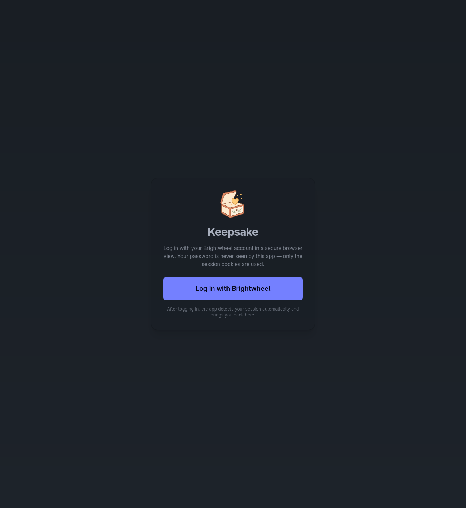
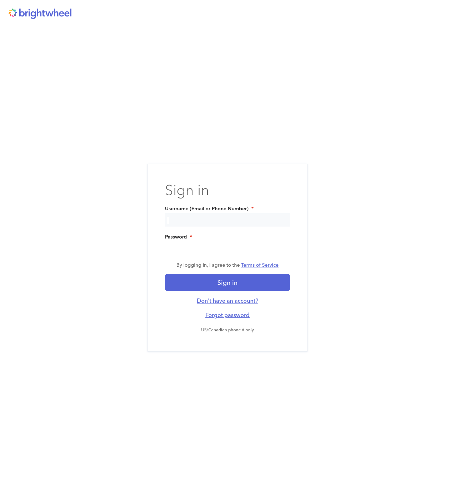
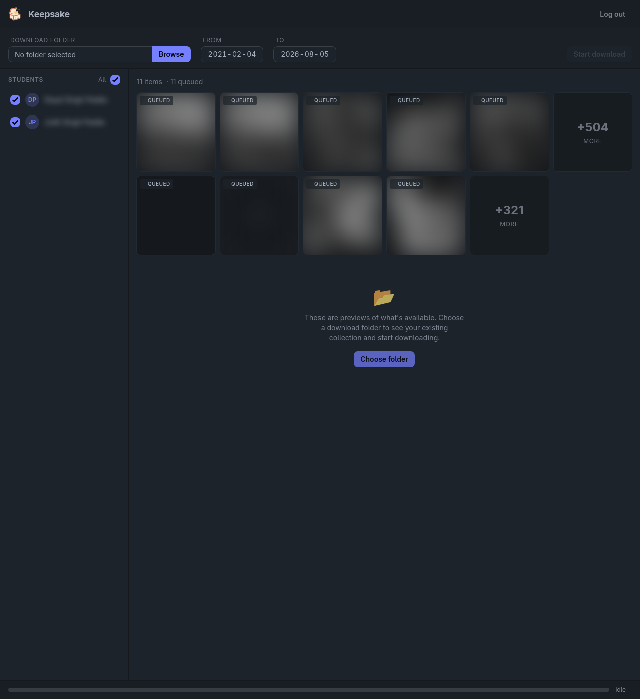
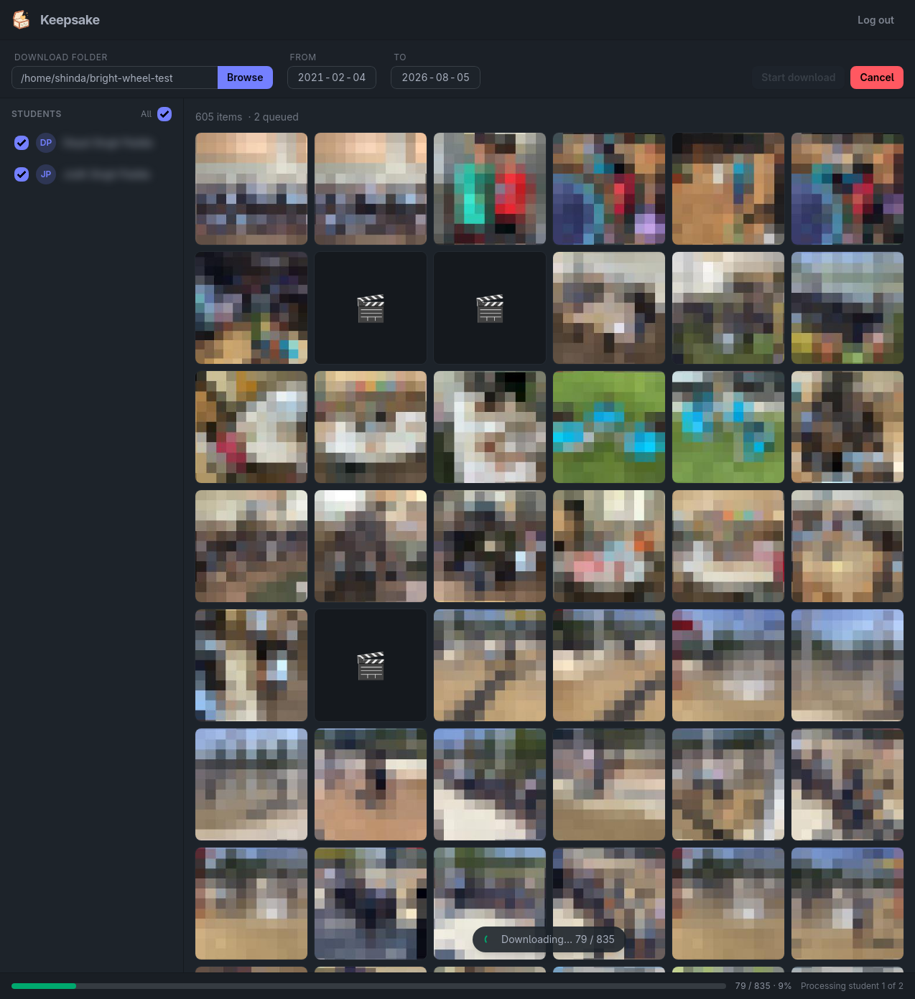

# Screenshots

A quick visual tour of Keepsake. These were captured in demo mode (`--demo`),
which pixelates photos and blurs student names for safe sharing.

## Login

Keepsake never sees your password. The button opens the real Brightwheel
site in a secure browser view.

## Brightwheel sign-in

You authenticate directly with Brightwheel — CAPTCHA and MFA flows work
exactly as they do in your browser. Keepsake only captures the resulting
session cookies.

## Pending previews

Before downloading, the grid shows what's available as desaturated "queued"
previews, along with "+N more" indicators for larger collections. Pick a
download folder, optionally narrow the date range, and start the download.

## Downloading

As files download, each tile animates from its placeholder into full color
in place. A live progress pill and footer bar track the overall run, and the
download can be cancelled at any time.
